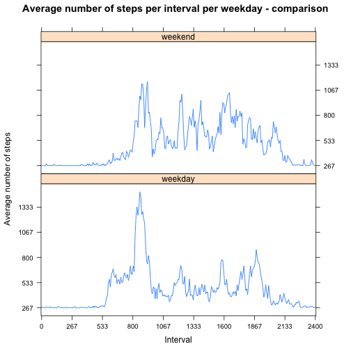

# Reproducible Research: Peer Assessment 1


## Loading and preprocessing the data

Firstly, the data must be downloaded if it is not yet present.

```r
if(!file.exists("activity.zip")){
    download.file(
        url = "https://d396qusza40orc.cloudfront.net/repdata%2Fdata%2Factivity.zip", 
        destfile = "activity.zip", 
        method = "curl")}
```

Next, the data must be unzipped.


```r
unzip("activity.zip")
```

Then, it can be read.


```r
activity <- read.table(
    file = "activity.csv", 
    header = TRUE, 
    sep = ",")
```

For proper analysis, the dates and intervals are converted to the correct format.


```r
activity$date <- as.Date(activity$date, 
                         format = "%Y-%m-%d")
activity$interval <- as.factor(activity$interval)
```

## What is mean total number of steps taken per day?

The steps per day are computed and a histogram is created:


```r
stepSum <- aggregate(steps ~ date, activity, sum)  
library(ggplot2)
ggplot(stepSum, aes(x=steps)) + geom_histogram(binwidth = 400)
```

 

Then, the overall mean and median were computed.

```r
mean(activity$steps, na.rm = TRUE)
```

```
## [1] 37.38
```

```r
median(activity$steps, na.rm = TRUE)
```

```
## [1] 0
```

Next, the mean and median per day are calculated. The mean can be plotted.


```r
stepMean <- aggregate(steps ~ date, activity, mean)
stepMedian <- aggregate(steps ~ date, activity, median)

library(lattice)
xyplot(steps ~ date, 
       type = "l", 
       data = stepMean, 
       xlab = "Date", 
       ylab = "Average number of steps",
       main = "Average number of steps per day")
```

 

```r
summary(stepMedian)
```

```
##       date                steps  
##  Min.   :2012-10-02   Min.   :0  
##  1st Qu.:2012-10-16   1st Qu.:0  
##  Median :2012-10-29   Median :0  
##  Mean   :2012-10-30   Mean   :0  
##  3rd Qu.:2012-11-16   3rd Qu.:0  
##  Max.   :2012-11-29   Max.   :0
```


## What is the average daily activity pattern?

To gain insight in the daily activity pattern, the average amount of steps per interval must me calculated firstly.


```r
intervalStepMean <- aggregate(steps ~ interval, activity, mean)
intervalStepMean$interval <- as.factor(intervalStepMean$interval)
```

For a clean graph, the number of tick marks is set and labels are created.

```r
tickMarks <- 10
at <- seq(1, nrow(intervalStepMean), length.out=tickMarks)
labels <- round(seq(000, 2400, length.out=tickMarks))
```

Then, a plot can be created.


```r
library(lattice)
a <- xyplot(steps ~ interval, 
            type = "l", 
            data = intervalStepMean, 
            scales=list(x=list(at=at), 
                        labels = labels),
            xlab = "Interval",
            ylab = "Average number of steps",
            main = "Average number of steps per interval per day")
print(a)
```

 

The interval with the highest average number of steps is calculated as follows:

```r
highestAvgSteps <- intervalStepMean[
    intervalStepMean$steps == max(intervalStepMean$steps, na.rm = TRUE),
    ]$interval
highestAvgSteps
```

```
## [1] 835
## 288 Levels: 0 5 10 15 20 25 30 35 40 45 50 55 100 105 110 115 120 ... 2355
```

## Imputing missing values

Firstly, the number of missing values must be found:


```r
summary(activity$steps)[7]
```

```
## NA's 
## 2304
```

### Strategy
To fill in missing values in the dataset, the average for that day and the mean for that 5-minute interval will be combined.


```r
activityFilled <- activity
activityFilled[which(is.na(activity)),]$steps <- intervalStepMean$steps

stepSumFilled <- aggregate(steps ~ date, activityFilled, sum)  
library(ggplot2)
ggplot(stepSum, aes(x=steps)) + geom_histogram(binwidth = 400)
```

 

The filled mean was acquired as follows:

```r
stepMeanFilled <- aggregate(steps ~ date, activityFilled, mean)
stepMedianFilled <- aggregate(steps ~ date, activityFilled, median)
```

A comparison of the mean and median of the filled and non-filled:

```r
summary(stepMeanFilled)
```

```
##       date                steps      
##  Min.   :2012-10-01   Min.   : 0.14  
##  1st Qu.:2012-10-16   1st Qu.:34.09  
##  Median :2012-10-31   Median :37.38  
##  Mean   :2012-10-31   Mean   :37.38  
##  3rd Qu.:2012-11-15   3rd Qu.:44.48  
##  Max.   :2012-11-30   Max.   :73.59
```

```r
summary(stepMean)
```

```
##       date                steps      
##  Min.   :2012-10-02   Min.   : 0.14  
##  1st Qu.:2012-10-16   1st Qu.:30.70  
##  Median :2012-10-29   Median :37.38  
##  Mean   :2012-10-30   Mean   :37.38  
##  3rd Qu.:2012-11-16   3rd Qu.:46.16  
##  Max.   :2012-11-29   Max.   :73.59
```

As can be observed, the mean and median are the same for both the filled and non-filled datasets.
The 1st and 3rd quartiles do differ: the first quartile of the filled dataset starts lower and the 3rd quartile of the filled dataset starts higher. This indicates a higher spread.


```r
summary(stepMedianFilled)
```

```
##       date                steps      
##  Min.   :2012-10-01   Min.   : 0.00  
##  1st Qu.:2012-10-16   1st Qu.: 0.00  
##  Median :2012-10-31   Median : 0.00  
##  Mean   :2012-10-31   Mean   : 4.47  
##  3rd Qu.:2012-11-15   3rd Qu.: 0.00  
##  Max.   :2012-11-30   Max.   :34.11
```

```r
summary(stepMedian)
```

```
##       date                steps  
##  Min.   :2012-10-02   Min.   :0  
##  1st Qu.:2012-10-16   1st Qu.:0  
##  Median :2012-10-29   Median :0  
##  Mean   :2012-10-30   Mean   :0  
##  3rd Qu.:2012-11-16   3rd Qu.:0  
##  Max.   :2012-11-29   Max.   :0
```

To illustrate the absence of significant difference in the average, a graph is constructed where the average of the filled and non-filled datasets are both represented.


```r
intervalStepMeanFilled <- aggregate(steps ~ interval, activity, mean)
intervalStepMeanFilled$interval <- as.factor(intervalStepMean$interval)

tickMarksFilled <- 10
atFilled <- seq(1, nrow(intervalStepMeanFilled), length.out=tickMarksFilled)
labelsFilled <- round(seq(000, 2400, length.out=tickMarksFilled))
```


```r
library(lattice)
library(latticeExtra)

# Create second plot
b <- xyplot(steps ~ interval, 
            type = "l", 
            data = intervalStepMeanFilled, 
            scales=list(x=list(at=atFilled), 
                        labels = labelsFilled),
            xlab = "Interval",
            ylab = "Average number of steps per day",
            main = "Average number of steps per interval per day - comparison")

# Overlay new plot
a + as.layer(b)
```

 

As can be observed from the plot, the average steps per day per interval does not significantly deviate from the original.

## Are there differences in activity patterns between weekdays and weekends?

To construct the weekend/weekday comparison, the following code was used:


```r
activityFilled$day <- FALSE
activityFilled[
    weekdays(activityFilled$date) == "Saturday" | weekdays(activityFilled$date) == "Sunday" , ]$day <- TRUE

# Create weekend/weekday column
activityFilled[activityFilled$day == FALSE, ]$day <- "weekday"
activityFilled[activityFilled$day == TRUE, ]$day <- "weekend"
activityFilled$day <- as.factor(activityFilled$day)

# Aggregate using new weekend/weekday column
intervalStepMeanFilled <- aggregate(steps ~ interval + day, activityFilled, mean)


# Create plot
xyplot(steps ~ interval | day, 
       type = "l", 
       data = intervalStepMeanFilled, 
       scales=list(x=list(at=atFilled), 
                   labels = labelsFilled),
       xlab = "Interval",
       ylab = "Average number of steps",
       main = "Average number of steps per interval per weekday - comparison",
       layout = c(1,2) # One column, two rows
       )
```

 

As can be observed from the plot, the average differs. On weekdays, the peak in the morning is higher and starts earlier, while in the weekend it is more equally distributed.
